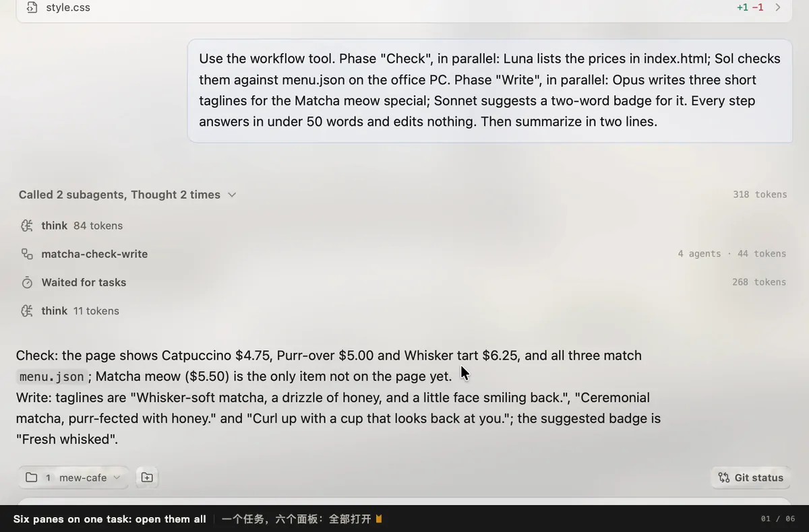

# Mewrk

> **Mewrk — Mew. Work.**

[English](README.md) · **简体中文**

Mewrk 是 macOS 与 Windows 上的桌面编程 Agent。和其他编程 Agent 一样，它会读写你的项目、运行命令、联网搜索、派出子代理，并在浏览器里检查自己的成果。不同之处在于，模型看到什么、做什么，始终由你掌控：你可以编辑它的上下文，为每个对话挑选工具，改写 Mewrk 加进去的每一句提示词。



## 开始使用

1. 从[官网](https://mewrk.dev/zh/)或[最新版本](https://github.com/catblob-hash/Mewrk/releases/latest)下载：macOS 13 及以上（Apple 芯片），或 Windows 10、11（x64）。
2. 如果你在用 Claude Code，在 **设置 → 提供商 → 模型提供商 → Claude Agent** 里点一下安装 Claude Agent 组件（Mewrk 从 npm 下载），之后会直接沿用它的登录。否则打开 **设置 → 提供商 → 模型提供商**，用 ChatGPT 账号登录，或者用你自己的 API Key 添加一个提供商。
3. 在侧边栏点 **新建项目** 添加一个文件夹，然后开始一个任务。

[文档](https://mewrk.dev/zh-CN/index.html)里有每一项设置的说明。

## 从源码构建

需要 Node.js 22.12 及以上和 stable 版 Rust，另外：

- **macOS 13 及以上：** 安装 Xcode Command Line Tools，然后运行一次 `bash scripts/setup-macos-dev.sh`，它会检查其余依赖并准备好仓库。
- **Windows：** Visual Studio Build Tools（MSVC），以及装有 mingw64 版 `gcc`、`make`、`perl` 的 [MSYS2](https://www.msys2.org)。

```bash
npm install
npm --prefix aisdk-service install
npm run build && npm run build:sidecar
npm run tauri:dev      # 从源码运行 Mewrk
npm run tauri:build    # 生成安装包或 .dmg，位于 src-tauri/target/release/bundle/
```

在 Linux 上可以改代码、跑检查（用 `bash scripts/setup-linux-dev.sh` 准备环境），但不能构建应用本身。

## 参与贡献

- 在 [Issues](https://github.com/catblob-hash/Mewrk/issues) 报告问题或提建议。
- 一个 Pull Request 只做一件事；改动较大时请先开 issue 讨论。推送前运行 `npm test` 和 `npm run test:rust`。

## 许可证

[GPL-3.0-or-later](LICENSE)。第三方组件及其许可见 [THIRD-PARTY-NOTICES.md](THIRD-PARTY-NOTICES.md)。
